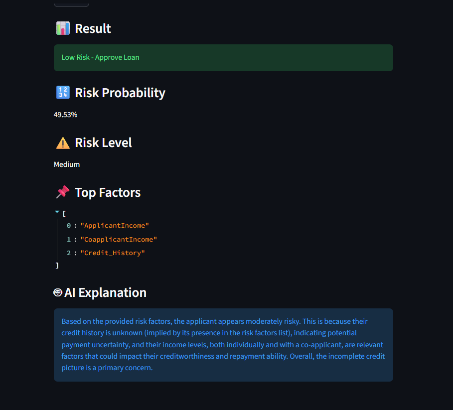

# 🏦 AI Loan Risk Analyzer

An end-to-end AI system that predicts loan default risk using Machine Learning, Explainable AI (SHAP), OCR, and LLM-based insights.

---

## 🚀 Features

- 📊 Loan default prediction using XGBoost
- 🔍 Explainable AI with SHAP (top risk factors)
- 📄 OCR document processing (Tesseract)
- 🤖 AI explanation using LLM (Groq / Llama3)
- 🌐 FastAPI backend
- 🎨 Streamlit UI

---

## 🧠 Tech Stack

- Machine Learning: Scikit-learn, XGBoost
- Explainability: SHAP
- Backend: FastAPI
- Frontend: Streamlit
- OCR: Tesseract
- LLM: Groq (Llama3)

---

## 📦 Installation

```bash
pip install -r requirements.txt

## 📸 UI Preview


